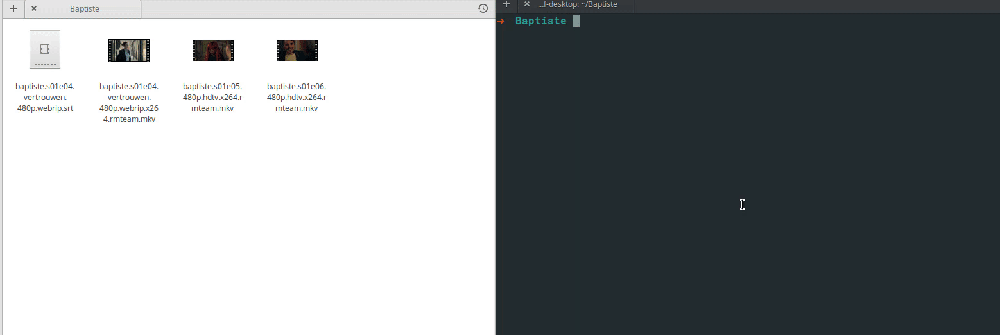

 
  

   

**This Gem only works for video files with `S[Number]E[Number]` (i.e., S01E02) format in their names.**  

# Subfinder

You have a TV series video files on you computer but you don't have subtitles or you have them but the name of each episode is not the same as teh video file.
Open the terminal, go to the folder where you saved your files, and run `subfinder`. It will find the similar subtitle files (only `.srt`) on the folder and rename it to video file. If the subtitles are not exists on your disk, then it will download them from `Subscene`, only if you provided the Subscene TV series list page URL. 

## Installation  

First you need to have `Ruby` and `Gem` on your machine. Run `ruby -v` and `gem -v` to make sure you have the. If not Google how to install them. It's easy.
Your Ruby version should be at least `2.5.1`. 

Then run:

`$ gem install subfinder`

## Usage  

`$ subfinder`  
 Without any switches, this will unzip all zipped or compressed files and find/rename them to correspondent video file. 

`$ subfinder -u https://subscene.com/subtitles/the-kominsky-method -l fa`  
- Use `-u` or `--url` to specify a URL page of a TV series on `subscene.com` website.  
- Use `-l` or `--language`for subtitle language you want. Default is English. `fa`, `en`, `ar`, `fr`, `es` are supported.  
- Run `subfinder --dryrun` to create set of mock files on you current directory and running Subfinder.  
- Also see `sunfinder -h` for help  
  

## Development

To run tests, run `rake test`.
To see all logs, run with `-d` or `--degub`  
Clone the project. Make changes and then `rake build` inside the project folder to create Gem.
Then `gem install pkg/subfinder-0.0.1.gem` to install it locally.

## License

The gem is available as open source under the terms of the [MIT License](https://opensource.org/licenses/MIT).

# TODO

- Add all language codes

